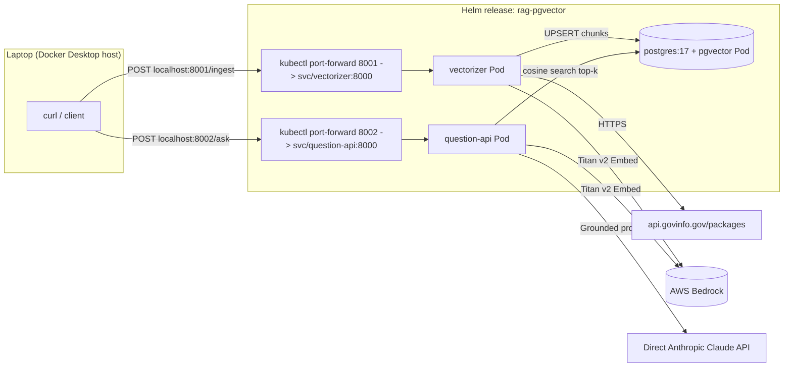
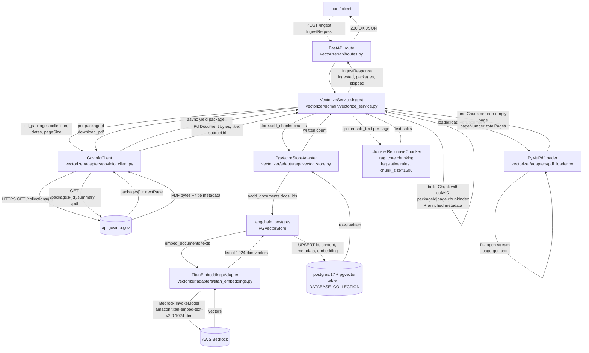
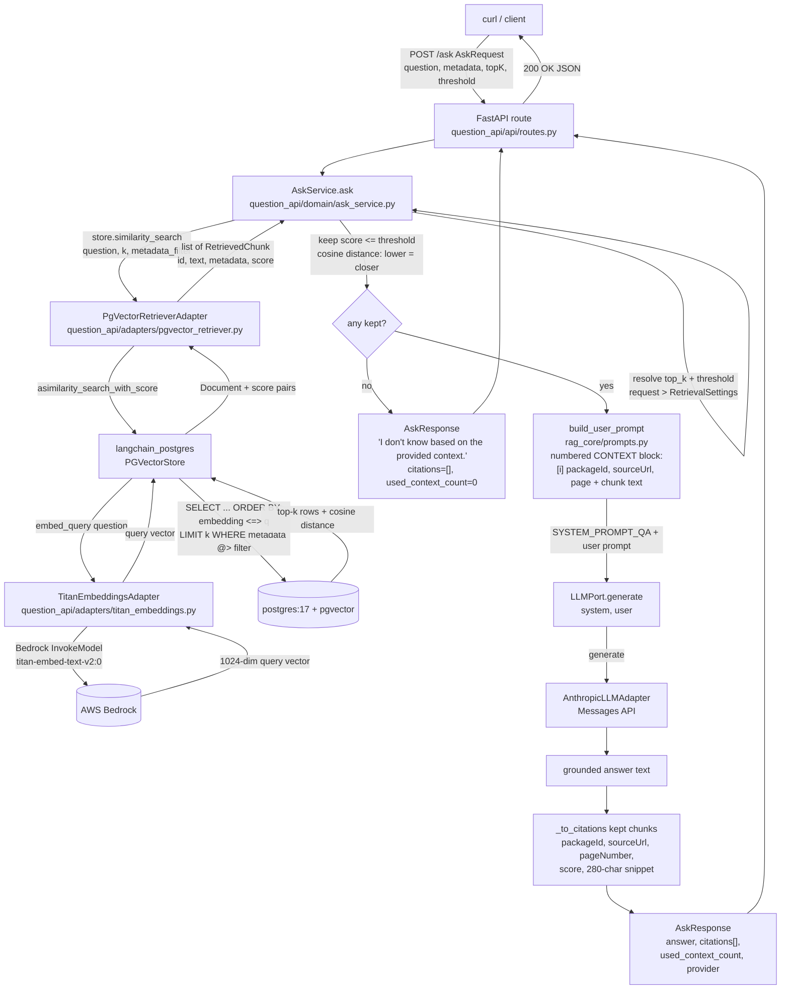

# rag-pgvector

A `uv`-managed Python 3.12 monorepo for a small, opinionated RAG stack:

- `vectorizer/` — FastAPI pod that pulls PDFs from [api.govinfo.gov](https://api.govinfo.gov), extracts text with PyMuPDF, splits with LangChain, embeds with an approved AWS Bedrock embedding model, and upserts into a vanilla `postgres:17 + apt postgresql-17-pgvector` database.
- `question-api/` — FastAPI pod that answers strictly-grounded questions: it embeds the incoming question, retrieves top-k chunks from pgvector with a metadata filter and similarity threshold, then asks direct Anthropic Claude to answer using only that context.
- `evals/` — DeepEval retriever benchmark that sweeps pgvector `top_k` and cosine-distance thresholds against hand-curated goldens for `BILLS-115hr1625enr`.
- `libs/rag-core/` — shared `Protocol` ports, the grounded system prompt, the chunk splitter, settings, and structlog config (DRY for both apps without coupling their deployments).
- `infra/` — custom `postgres-pgvector` Dockerfile and an umbrella Helm chart that deploys all three pods (`postgres`, `vectorizer`, `question-api`) into Docker Desktop's built-in Kubernetes.

## Architecture



## Service flows

The two pods are independently deployable microservices. The vectorizer is the write side (ingest + embed + upsert); the question-api is the read side (embed + retrieve + ground + generate). They share nothing at runtime — only the pgvector table and the `Protocol` ports in `libs/rag-core`.

### Vectorizer — `POST /ingest` → pgvector



Notes:

- `VectorizeService` is pure orchestration — every IO call goes through a port adapter (`GovInfoClientPort`, `DocumentLoaderPort`, `VectorStorePort`).
- Chunk IDs are deterministic UUIDv5 of `packageId|pageNumber|chunkIndex` under a fixed namespace, so re-ingesting the same package upserts in place (the `id` column in pgvector is typed `UUID`, so the id has to be a real UUID — not a hex digest).
- Embedding is *not* called directly by `VectorizeService`; `PGVectorStore` calls `TitanEmbeddingsAdapter.embed_documents` internally during `aadd_documents`.

### Question-API — `POST /ask` → grounded answer



Notes:

- The question is embedded by `TitanEmbeddingsAdapter.embed_query` *inside* `PGVectorStore.asimilarity_search_with_score` — `AskService` never touches embeddings directly.
- pgvector returns cosine **distance**, so `AskService._apply_threshold` keeps chunks with `score <= threshold` (lower = more similar).
- If nothing survives the threshold, the service short-circuits with the fixed `"I don't know based on the provided context."` reply and never calls the LLM (no spend, no hallucination surface).
- Grounding happens in `rag_core.prompts.build_user_prompt`: kept chunks become a numbered `CONTEXT:` block carrying `packageId`, `sourceUrl`, and `pageNumber`, paired with `SYSTEM_PROMPT_QA` which forbids tool use and mandates a trailing `Sources:` section.
- The LLM is a `Protocol` port implemented by direct Anthropic Claude API calls in `question_api/core/composition.py`.

## Prerequisites

- macOS or Linux with [Docker Desktop](https://www.docker.com/products/docker-desktop/), with **Kubernetes enabled**: `Docker Desktop → Settings → Kubernetes → Enable Kubernetes → Apply & restart`. The cluster appears in `kubectl config get-contexts` as `docker-desktop`.
- `uv` ≥ 0.5 (`brew install uv`)
- `helm` ≥ 3.13 (`brew install helm`)
- `kubectl` (`brew install kubectl`)

> Docker Desktop's built-in Kubernetes shares the Docker daemon's image store, so locally-built images are visible to the cluster without any push or `kind load` step. We do not use kind, minikube, or any external cluster tool.

## Environment variables

Copy and edit `.env`:

```bash
cp .env.example .env
$EDITOR .env
```

| Key | What it is | Required when |
|-----|-----------|---------------|
| `ANTHROPIC_API_KEY_FILE` / `ANTHROPIC_API_KEY` | Direct Anthropic API key file or value for Claude generation | always |
| `ANTHROPIC_DIRECT_MODEL` | Direct Anthropic model name, e.g. `claude-3-5-sonnet-latest` | optional |
| `AWS_REGION` | Region used for embedding AWS clients | always |
| `EMBEDDING_MODEL` | Embedding model ID for the direct embedding Bedrock credential path | always |
| `BEDROCK_EMBEDDING_DIMENSIONS` | `1024` | always |
| `AWS_PROFILE` / `AWS_DEFAULT_PROFILE` | Optional local AWS profile that Helm can export into temporary pod credentials for embeddings | local Docker Desktop with `aws.auth.mode=accessKey` |
| `AWS_ACCESS_KEY_ID` / `AWS_SECRET_ACCESS_KEY` / `AWS_SESSION_TOKEN` | Optional local AWS credentials for embeddings | only if `aws.auth.mode=accessKey` |
| `AWS_BEARER_TOKEN_BEDROCK` | Bedrock API key for the embedding account; embeddings use this old direct credential path | embeddings |
| `GOVINFO_API_KEY` | Free key from <https://api.data.gov/signup/> | always |
| `DATABASE_URL` | psycopg3 URL for pgvector | always |
| `RETRIEVAL_TOP_K` / `RETRIEVAL_SCORE_THRESHOLD` | Defaults `5` / `0.25` | optional |
| `DEEPEVAL_JUDGE_PROVIDER` | `anthropic` or `ollama` for the retriever benchmark judge | benchmark runs |
| `DEEPEVAL_TOP_K_GRID` / `DEEPEVAL_THRESHOLD_GRID` | Comma-separated retriever benchmark sweep grids | optional |
| `DEEPEVAL_GOLDENS_PATH` | Golden dataset path for `rag-evals` | optional |

## Authentication

Direct Anthropic Claude is the question-answering path. Put the API key in `claudeapi.txt` and set `ANTHROPIC_API_KEY_FILE=claudeapi.txt`, or set `ANTHROPIC_API_KEY` directly in the environment. `claudeapi.txt` is ignored by Git.

Embeddings use the existing Bedrock embedding path: `EMBEDDING_MODEL`, `BEDROCK_EMBEDDING_DIMENSIONS`, and `AWS_BEARER_TOKEN_BEDROCK` (or direct AWS keys if that is how the embedding account is configured). Anthropic does not provide embeddings, so changing this requires selecting a replacement embedding provider.

For local Helm deployments, use `aws.auth.mode=accessKey` only when the embedding account requires AWS keys. `scripts/helm-install.sh` and `scripts/ps/Helm-Install.ps1` can export these from `AWS_PROFILE` / `AWS_DEFAULT_PROFILE` with `aws configure export-credentials`, including `AWS_SESSION_TOKEN` for SSO or other temporary sessions. Set `bedrock.embeddingBearerToken` for bearer-token embedding access. For EKS, use `aws.auth.mode=irsa` and set `aws.auth.irsaRoleArn` to the embedding role.

## Local pod workflow (default)

```bash
# 1. Verify Docker Desktop Kubernetes is enabled and build the three images
bash scripts/docker-desktop-up.sh

# 2. Install the Helm release (reads .env)
bash scripts/helm-install.sh

# 3. Forward all three services to the laptop
bash scripts/port-forward.sh
```

**Windows (PowerShell):** Equivalent automation lives under [`scripts/ps/`](scripts/ps/). From the repo root:

```powershell
.\scripts\ps\Rag.ps1 docker-up
.\scripts\ps\Rag.ps1 helm-install
.\scripts\ps\Rag.ps1 port-forward
```

You can run individual scripts (for example `.\scripts\ps\Helm-Install.ps1`) or use `.\scripts\ps\Rag.ps1 help` for command aliases. Prerequisites on PATH include **`kubectl`**, **`helm`**, and (for Bedrock helper scripts) [`jq`](https://jqlang.github.io/jq/). `.\scripts\ps\Ask.ps1` and `.\scripts\ps\Ingest-Package.ps1` use native PowerShell JSON handling and do not require `jq`. Install Helm on Windows with e.g. `winget install Helm.Helm` ([install docs](https://helm.sh/docs/intro/install/)).

Then:

```bash
# Vectorize a govinfo collection (small sample)
curl -X POST http://localhost:8001/ingest \
  -H 'content-type: application/json' \
  -d '{"collection":"BILLS","lastModifiedStartDate":"2026-01-01T00:00:00Z","pageSize":25,"maxPackages":5}'

# Ask a grounded question
curl -X POST http://localhost:8002/ask \
  -H 'content-type: application/json' \
  -d '{"question":"What does the latest BILLS package say about appropriations?","metadata":{"collection":"BILLS"},"topK":5}'
```

## Running example (helper scripts)

Once Helm is installed and `bash scripts/port-forward.sh` is up (see [Local pod workflow](#local-pod-workflow-default)), the two helper scripts in `scripts/` cover the full ingest-then-ask demo without writing curl by hand.

### 1. Load a single govinfo PDF into pgvector

```bash
./scripts/ingest-package.sh BILLS-115hr1625enr
```

This wraps `POST http://localhost:8001/ingest/package`. The vectorizer pod resolves the packageId against `api.govinfo.gov/packages/{id}/summary` + `/pdf`, splits each page with the shared `chonkie.RecursiveChunker` configured with legislative rules (SEC., TITLE, §, etc. as level-0 boundaries; chunk_size=1600 chars), embeds every split with Titan v2 (1024-dim), and upserts into `rag_chunks` with a deterministic UUIDv5 chunk id (so re-running the same packageId is idempotent).

Expected response shape:

```json
{ "ingested": 3375, "packages": 1, "skipped": 0, "collection": "BILLS" }
```

Verify the rows actually landed in pgvector:

```bash
kubectl -n rag exec rag-postgres-0 -- psql -U rag -d rag -At \
  -c "select count(*), count(distinct metadata->>'packageId') as packages from rag_chunks;"
```

The `rag_chunks` table is created with renamed/extended columns (overrides on
`langchain-postgres`'s defaults):

| Column | Type | Source |
|---|---|---|
| `id` | `uuid` (PK) | deterministic UUIDv5 of `packageId\|pageNumber\|chunkIndex` |
| `content` | `text` | chunk text |
| `embedding` | `vector(1024)` | Titan v2 embedding |
| `metadata` | `jsonb` | full chunk metadata blob (packageId, pageNumber, sourceUrl, ...) |
| `embedding_model` | `text` | hoisted from metadata, e.g. `amazon.titan-embed-text-v2` |
| `embedding_model_version` | `text` | hoisted from metadata, e.g. `0` |

The last two are *hoisted metadata columns*: PGVectorStore writes them from
`Document.metadata[<name>]` into typed columns on insert AND keeps them in the
JSON blob, so you can index/filter on them cheaply (`WHERE
embedding_model_version = '0'`) without paying for JSON extraction. The values
are stamped per-chunk by `PgVectorStoreAdapter.add_chunks` from the configured
`EMBEDDING_MODEL` (split on the trailing `:<rev>` suffix), so every
row is self-describing about which model produced its vector — handy when
swapping embedders or running A/B corpora in the same table.

Script knobs (override via env or positional arg):

| Var | Default | Purpose |
|---|---|---|
| `$1` / `PACKAGE_ID` | (required) | govinfo packageId — e.g. `BILLS-115hr1625enr`, `FR-2018-04-12`, `CREC-2018-01-03` |
| `VECTORIZER_URL` | `http://localhost:8001` | Base URL of the port-forwarded vectorizer |
| `METADATA` | `{"source":"ingest-package.sh"}` | JSON merged into every chunk's metadata (handy for tagging ingest runs) |

### 2. Ask a grounded question

```bash
./scripts/ask.sh
```

With **no arguments**, this asks a built-in demo question that targets the bill loaded above:

> What conditions does the Consolidated Appropriations Act place on U.S. assistance to the West Bank and Gaza, and what restrictions apply to the Palestinian Authority?

That question hits SEC. 1004 + Sec. 7038–7040 of `BILLS-115hr1625enr`, which is a self-contained multi-page policy framework, so the LLM has plenty of grounded context to write a structured, citable answer. You'll get back a multi-section response plus 6 citations, each with `packageId`, `pageNumber`, `sourceUrl`, cosine-distance `score`, and a ~220-char snippet.

Other invocation patterns:

```bash
./scripts/ask.sh "your custom question here"                     # custom question
QUESTION="..." ./scripts/ask.sh                                  # via env var
TOP_K=10 SCORE_THRESHOLD=0.50 ./scripts/ask.sh "..."             # tighter retrieval
METADATA='{"packageId":"BILLS-115hr1625enr"}' ./scripts/ask.sh   # restrict to one bill
RAW=1 ./scripts/ask.sh ...                                       # raw JSON (pipe to jq)
```

Notes on the script-level retrieval defaults:

- `ask.sh` ships with `TOP_K=6` and `SCORE_THRESHOLD=0.80` baked in as defaults so the no-arg invocation actually returns context. Over real bill text, Titan v2 cosine distances typically land in the 0.4–0.7 range, so the pod's stricter `RETRIEVAL_SCORE_THRESHOLD=0.25` default suppresses real matches for natural-language questions. To fall back to the pod-level defaults, delete those two lines in `scripts/ask.sh` (or override per call: `TOP_K=5 SCORE_THRESHOLD=0.25 ./scripts/ask.sh ...`).
- `scoreThreshold` is cosine **distance** (lower = stricter / more similar), not similarity. A chunk with `score=0.42` is closer to the query than one with `score=0.71`.
- If no chunks clear the threshold, `AskService` short-circuits with `"I don't know based on the provided context."` and never calls the LLM, so a 0-citation reply costs no Bedrock or Ollama tokens.

## Local non-pod workflow (fast iteration)

```bash
# Just run the postgres+pgvector image via compose
docker compose up -d postgres

# Sync the workspace
uv sync --all-packages

# Run each service directly on the host
uv run uvicorn vectorizer.main:app    --reload --port 8001
uv run uvicorn question_api.main:app  --reload --port 8002
```

If you are on a network that blocks or MITMs public PyPI, use an internal mirror (for example JFrog) for both host `uv sync` and image builds. Image builds: `documentation/DOCKER_PYPI_MIRROR.md`.

## Host Aliases

Docker Desktop Kubernetes resolves `host.docker.internal` from inside pods automatically. If you ever switch to a cluster that does not, override the chart value:

```yaml
qa:
  hostAliases:
    - ip: "192.168.65.2"        # the laptop's host IP from inside the cluster
      hostnames: ["host.docker.internal"]
```

## Repo layout

```
rag-pgvector/
├── pyproject.toml              # uv workspace root
├── uv.lock
├── .env.example
├── docker-compose.yml          # postgres-only convenience for non-pod dev
├── vectorizer/                 # service:  ingest + embed + upsert
├── question-api/               # service: retrieve + ground + generate
├── evals/                      # DeepEval retriever benchmark
├── libs/rag-core/              # shared Protocols, prompts, chunker, settings
├── infra/
│   ├── docker/postgres-pgvector/   # FROM postgres:17 + apt postgresql-17-pgvector
│   └── helm/rag-pgvector/          # umbrella chart (3 pods, no Ingress)
├── scripts/                    # docker-desktop-up, helm-install, port-forward, seed-ingest
└── tests/                      # repo-level tests (helm lint + helm template)
```

## Tests

```bash
uv run pytest -q              # 19 tests, no network/services required
```

The test suite covers:

- Prompt + chunker invariants in `libs/rag-core/tests/`.
- Vectorizer domain orchestration with fake ports (`FakeGovInfoClient`, `FakeLoader`, `FakeStore`).
- govinfo HTTP client with `respx` mocks.
- Question-api retrieval/threshold/grounding with fake ports.
- Retriever benchmark grid, threshold filtering, and metadata-filter forwarding with fake ports.
- Helm chart smoke tests: `helm lint` + `helm template` in supported `aws.auth.mode` configurations.

A separate `@pytest.mark.integration` marker is reserved for testcontainers-backed adapter tests against a real pgvector — these are opt-in (run with `pytest -m integration`).
Retriever benchmark integration: `uv run pytest -m integration evals/tests/` (requires `BILLS-115hr1625enr` ingested).

## Things explicitly out of scope

- No CronJob ingestion scheduler — ingestion is operator-driven via `POST /ingest` per the original design.
