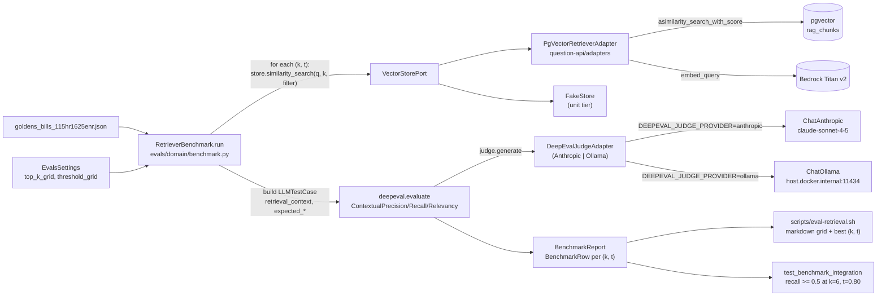

## Why DeepEval, why now

The user's framing is right: DeepEval's PGVector tutorial frames pgvector evaluation around **tuning retriever hyperparameters** (LIMIT / top_k, similarity threshold, embedding model). Of all RAG eval frameworks it's the only one whose docs treat pgvector as a first-class retriever to *tune*, not just a place to dump vectors. We mirror that exact posture: the new project is a **retriever benchmark**, not a generic eval harness.

The repo is already shaped for this. `PgVectorRetrieverAdapter` ([question-api/src/question_api/adapters/pgvector_retriever.py](question-api/src/question_api/adapters/pgvector_retriever.py)) implements `VectorStorePort` from [libs/rag-core/src/rag_core/ports.py](libs/rag-core/src/rag_core/ports.py). Anything that depends on the port can drive it — including a DeepEval test case builder.

## New workspace member: `evals/`

Sibling to `vectorizer/` and `question-api/`, identical layout (Hexagonal: `adapters/`, `core/`, `domain/`):

```
evals/
├── pyproject.toml                # name = "rag-evals"
├── README.md
├── src/rag_evals/
│   ├── adapters/
│   │   ├── deepeval_judge.py     # DeepEvalBaseLLM wrapper -> Anthropic Claude / Ollama (reuses existing keys)
│   │   └── deepeval_retriever.py # adapts VectorStorePort -> retrieval_context list[str] for LLMTestCase
│   ├── core/
│   │   ├── settings.py           # EvalsSettings (judge provider, sweep grids, goldens path)
│   │   └── composition.py        # build_container(): live retriever + live judge
│   ├── domain/
│   │   ├── golden.py             # Golden(question, expected_output, expected_retrieval_context, metadata_filter)
│   │   └── benchmark.py          # RetrieverBenchmark.run(goldens, top_k_grid, threshold_grid) -> BenchmarkReport
│   └── data/
│       └── goldens_bills_115hr1625enr.json  # 4-6 goldens for the demo bill from scripts/ask.sh
└── tests/
    ├── _evals_fakes.py
    ├── conftest.py
    ├── test_benchmark_unit.py            # default tier (FakeStore + stub judge)
    └── test_benchmark_integration.py     # @pytest.mark.integration (live pgvector + live judge)
```

`evals/pyproject.toml` deps: `rag-core` (workspace), `deepeval>=2.0`, `langchain-anthropic`, `langchain-ollama`, `langchain-aws`, `langchain-postgres`, and `psycopg[binary]`.

## Domain — `RetrieverBenchmark`

Pure orchestration over the existing port (mirrors `AskService` in [question-api/src/question_api/domain/ask_service.py](question-api/src/question_api/domain/ask_service.py)):

```python
class RetrieverBenchmark:
    def __init__(self, *, store: VectorStorePort, judge: DeepEvalBaseLLM, logger=None) -> None: ...

    async def run(
        self,
        goldens: Sequence[Golden],
        *,
        top_k_grid: Sequence[int],
        threshold_grid: Sequence[float],
    ) -> BenchmarkReport:
        # for each (k, t) cell:
        #   for each golden:
        #     hits = await self._store.similarity_search(g.question, k=k, metadata_filter=g.metadata_filter)
        #     kept = [h for h in hits if h.score <= t]                      # same convention as AskService._apply_threshold
        #     test_cases.append(LLMTestCase(
        #         input=g.question,
        #         actual_output="",                                          # retriever-only metrics ignore actual_output
        #         expected_output=g.expected_output,
        #         retrieval_context=[h.text for h in kept],
        #         expected_retrieval_context=g.expected_retrieval_context,
        #     ))
        #   results = evaluate(test_cases, metrics=[ContextualPrecision, ContextualRecall, ContextualRelevancy])
        #   report.add_row(BenchmarkRow(top_k=k, threshold=t, precision=..., recall=..., relevancy=...))
```

Reusing `AskService._apply_threshold`'s "lower cosine distance = more similar" convention is critical so benchmark numbers translate 1:1 to production retrieval behavior.

## Adapters

- `DeepEvalJudgeAdapter` in `evals/src/rag_evals/adapters/deepeval_judge.py` — subclass of `deepeval.models.DeepEvalBaseLLM` that holds a `ChatAnthropic` (or `ChatOllama`) and implements `generate()` / `a_generate()`. Mirrors the dual-provider wiring from [question-api/src/question_api/core/composition.py](question-api/src/question_api/core/composition.py) lines 43-50, switched on a new `DEEPEVAL_JUDGE_PROVIDER` env (defaults to `anthropic`).
- `deepeval_retriever.py` is just a one-function helper that converts `list[RetrievedChunk]` -> `list[str]` (DeepEval's `retrieval_context` shape). It does **not** subclass `DeepEvalBaseRetrievalModel` — we want to drive the sweep ourselves, not delegate it.

## Goldens dataset

Hand-curated JSON for `BILLS-115hr1625enr` (the same package the existing `scripts/ask.sh` defaults to), e.g.:

```json
[
  {
    "question": "What conditions does the Consolidated Appropriations Act place on U.S. assistance to the West Bank and Gaza?",
    "expected_output": "Assistance is conditioned on Palestinian Authority compliance with anti-terrorism, governance, and reform requirements...",
    "expected_retrieval_context": ["Sec. 7038", "Sec. 7039", "Sec. 7040"],
    "metadata_filter": {"packageId": "BILLS-115hr1625enr"}
  }
]
```

4-6 goldens is plenty for a benchmark — each one already costs 3 metric LLM judgments per (k, t) cell, so a 3x3 sweep with 6 goldens = 162 judge calls.

## Settings + env

Add to `libs/rag-core/src/rag_core/settings.py` (keep the DRY pattern):

```python
class DeepEvalSettings(_BaseEnvSettings):
    judge_provider: Literal["anthropic", "ollama"] = Field(default="anthropic", alias="DEEPEVAL_JUDGE_PROVIDER")
    top_k_grid: list[int] = Field(default_factory=lambda: [3, 5, 8], alias="DEEPEVAL_TOP_K_GRID")
    threshold_grid: list[float] = Field(default_factory=lambda: [0.4, 0.6, 0.8], alias="DEEPEVAL_THRESHOLD_GRID")
    goldens_path: str = Field(default="evals/src/rag_evals/data/goldens_bills_115hr1625enr.json", alias="DEEPEVAL_GOLDENS_PATH")
```

Append matching keys to `.env` and `.env.example`.

## Tests

Two-tier, matching the README's stated convention ("A separate `@pytest.mark.integration` marker is reserved for testcontainers-backed adapter tests against a real pgvector — these are opt-in"):

1. **`evals/tests/test_benchmark_unit.py`** — default tier:
   - Uses `FakeStore` (copy/re-import of [question-api/tests/_question_api_fakes.py](question-api/tests/_question_api_fakes.py)) seeded with deterministic `RetrievedChunk`s.
   - Uses a `StubJudge(DeepEvalBaseLLM)` that returns fixed strings (DeepEval metrics that LLM-judge in unit mode get monkeypatched via `metric.measure = lambda tc: 0.9` — DeepEval supports this).
   - Asserts: one `BenchmarkRow` per `(k, t)` cell; threshold filtering removes high-distance hits before metrics run; metadata_filter is forwarded to `store.similarity_search`.
   - Runs in `.venv/bin/pytest -q` with no network.

2. **`evals/tests/test_benchmark_integration.py`** — `@pytest.mark.integration`:
   - Skips if `AWS_BEARER_TOKEN_BEDROCK` / `ANTHROPIC_API_KEY` / `DATABASE_URL` reachable check fails.
   - Skips if `select count(*) from rag_chunks where metadata->>'packageId'='BILLS-115hr1625enr'` returns 0 (i.e. user hasn't run `scripts/ingest-package.sh BILLS-115hr1625enr` yet).
   - Builds the live container via `composition.build_container(EvalsSettings())`, runs the benchmark with the default grid, asserts `ContextualRecall >= 0.5` at `(k=6, t=0.80)` — the same defaults `scripts/ask.sh` ships with — so a regression in either retrieval or the embedding model breaks CI.
   - Run via `.venv/bin/pytest -m integration evals/tests/`.

## Workspace + tooling wiring

Root `pyproject.toml` includes `evals/src` in `tool.ruff.src`, `tool.mypy.mypy_path`, and `tool.pytest.ini_options.testpaths`. The `evals` package uses **setuptools** and path dependencies on `libs/rag-core` and `question-api` (see `evals/pyproject.toml`).

## CLI runner

`scripts/eval-retrieval.sh` — mirrors `scripts/ask.sh` posture:

```bash
PACKAGE_ID="${PACKAGE_ID:-BILLS-115hr1625enr}" \
TOP_K_GRID="${TOP_K_GRID:-3,5,8}" \
THRESHOLD_GRID="${THRESHOLD_GRID:-0.4,0.6,0.8}" \
./.venv/bin/python -m rag_evals.cli
```

`rag_evals.cli` prints a markdown table of `(top_k, threshold) -> precision / recall / relevancy` per cell, plus the best (k, t) per metric. Optional, but matches the operator-driven UX of `scripts/ingest-package.sh` + `scripts/ask.sh`.

## Docs

- `evals/README.md` — short, mirrors structure of `vectorizer/README.md` and `question-api/README.md`.
- `README.md` (root) — add `evals/` to the "Repo layout" tree and one line to the "Tests" section: "Retriever benchmark: `.venv/bin/pytest -m integration evals/tests/` (requires `BILLS-115hr1625enr` ingested)."

## Out of scope (deliberately, mirroring repo's existing scope discipline)

- No DeepEval `Synthesizer` for goldens — hand-curate 4-6 to keep CI deterministic and zero-cost on the unit tier.
- No end-to-end RAG metrics (Faithfulness, AnswerRelevancy, Hallucination) — the user's framing is explicit about retriever tuning. Easy follow-up: add an `EndToEndBenchmark` next to `RetrieverBenchmark` that calls the live `/ask` endpoint.
- No Helm chart for `evals/` — it is a CI/operator tool, not a long-running pod.

## Diagram


 